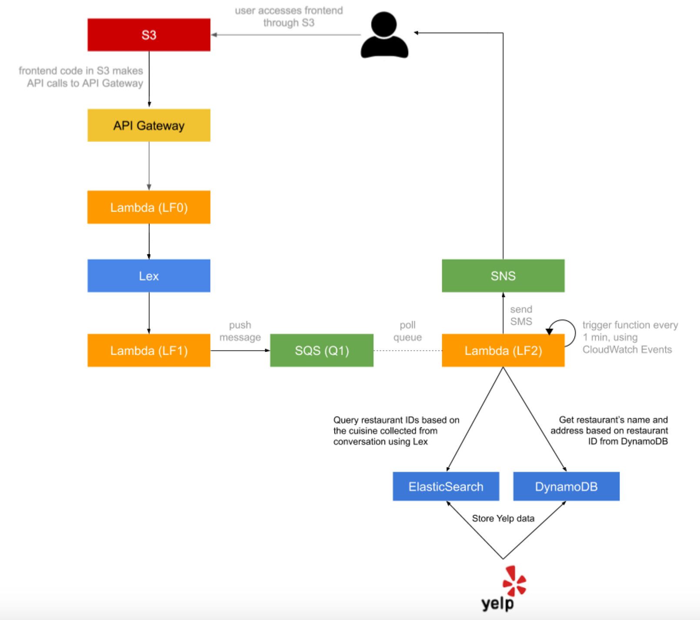
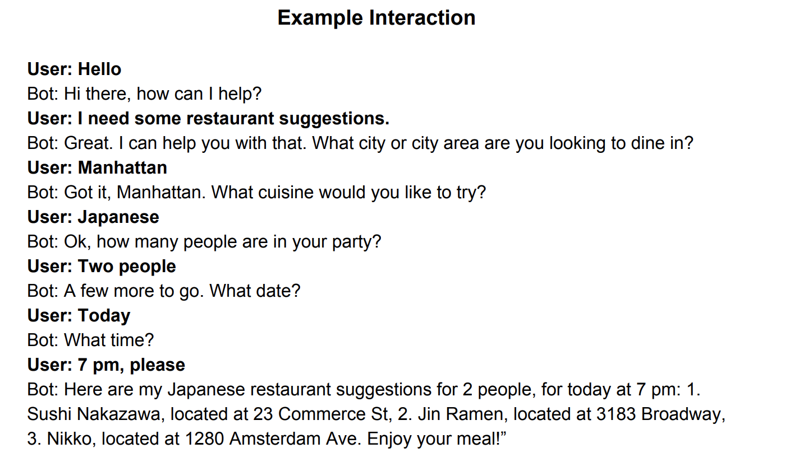
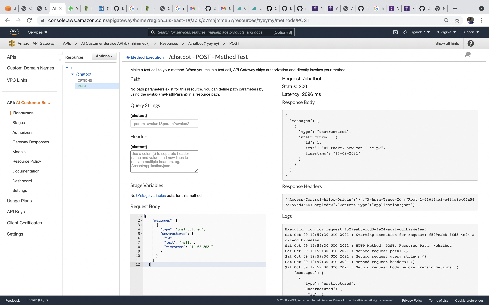
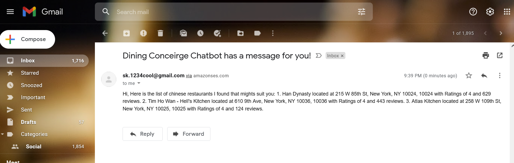

# Dining-Conceirge-Bot-Cloud
## Welcome to our Repository

### S3 Bucket Link :  http://dinecon.s3-website-us-east-1.amazonaws.com/

## Chat Architecture Diagram

## Chat Example

We have created a serverless, micro service-driven web application created completely using AWS cloud services. The main application of this chatbot is to provide restaurant recommendations to the users based on the preferences provided to it through conversations.

We have support for Yelp-API with suggestions and real time chat.

## Functionalites Deployed

    1. Amazon S3 - To host the frontend
    2. Amazon Lex - To create the bot
    3. API Gateway - To set up the API
    4. Amazon SQS - to store user requests on a first-come bases
    5. ElasticSearch Service - To quickly get restaurant ids based on the user preferences of cuisine collected from SQS
    6. DynamoDB - To store the restaurant data collected using Yelp API
    7. Amazon SES - to send restaurant suggestions to users through email
    8. Lambda - To send data from the frontend to API and API to Lex, validation, collecting restaurant data, sending suggestions using SNS.
    9. Yelp API - To get suggestions for food

## Procedure :
    1. Build and deploy the frontend of the application
      a. Implement a chat user interface, where the user can write messages and get responses back. You can use open source libraries and frameworks that give you this UI UX out of the box.
      b. Host your frontend in an AWS S3 bucket i. Set the bucket up for website hosting ii. https://docs.aws.amazon.com/AmazonS3/latest/dev/HostingWebsiteOnS3Setup.html
    
    2. Build the API for your cloud application.
    3. Build a Dining Concierge chatbot using Amazon Lex. 
      a. Create a new bot using the Amazon Lex service. Read up the documentation on all things Lex, for more information:                                                               https://docs.aws.amazon.com/lex/latest/dg/getting-started.html

      b. Create a Lambda function (LF1) and use it as a code hook for Lex, which essentially entails the invocation of your Lambda before Lex responds to any of your requests -- this gives you the chance to manipulate and validate parameters as well as format the bot’s responses. More documentation on Lambda code hooks at the following, link: https://docs.aws.amazon.com/lex/latest/dg/using-lambda.html
      

    4. Integrate the Lex chatbot into your chat API
      a. Use the AWS SDK to call your Lex chatbot from the API Lambda (LF0).
      b. When the API receives a request, you should 1. extract the text message from the API request, 2. send it to your Lex chatbot, 3. wait for the response, 4. send back the response from Lex as the API response.
      
    5. Use the Yelp API to collect 5,000+ random restaurants from Manhattan.
    6. Create an ElasticSearch instance using the AWS ElasticSearch Service.
       Create an ElasticSearch index called “restaurants”
       Create an ElasticSearch type under the index “restaurants” called “Restaurant”
       Store partial information for each restaurant scraped in ElasticSearch under the “restaurants” index, where each entry has a “Restaurant” data type. This data type will be of composite type stored as JSON in ElasticSearch. https://www.elastic.co/guide/en/elasticsearch/guide/current/mapping.html. You only need to store RestaurantID and Cuisine for each restaurant.
    7. Build a suggestions module, that is decoupled from the Lex chatbot.Create a new Lambda function (LF2) that acts as a queue worker. Whenever it is invoked it pulls a message from the SQS queue (Q1),gets a random restaurant recommendation for the cuisine collected through conversation from ElasticSearch and DynamoDB, formats them and sends them over text message to the phone number included in the SQS message, using SES.
        i. Use the DynamoDB table “yelp-restaurants” (which you created from Step 1) to fetch more information about the restaurants (restaurant name, address, etc.), since the restaurants stored in ElasticSearch will have only a small subset of fields from each restaurant.
        ii. Modify the rest of the LF2 function if necessary to send the user text/email. Set up a CloudWatch event trigger that runs every minute and invokes the Lambda function as a result:https://docs.aws.amazon.com/AmazonCloudWatch/latest/events/RunLabdaSchedule.html. This automates the queue worker Lambda to poll and process suggestion requests on its own.
  

